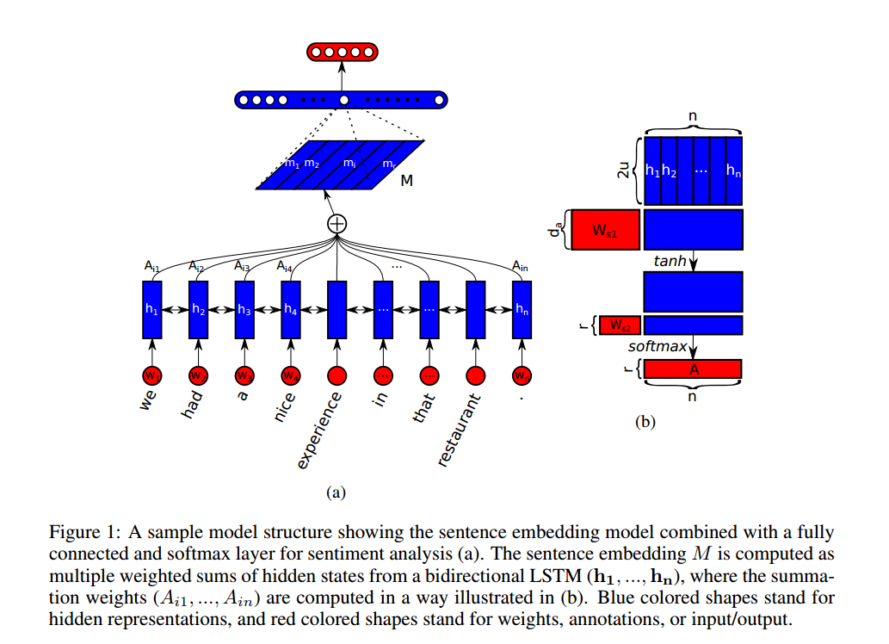
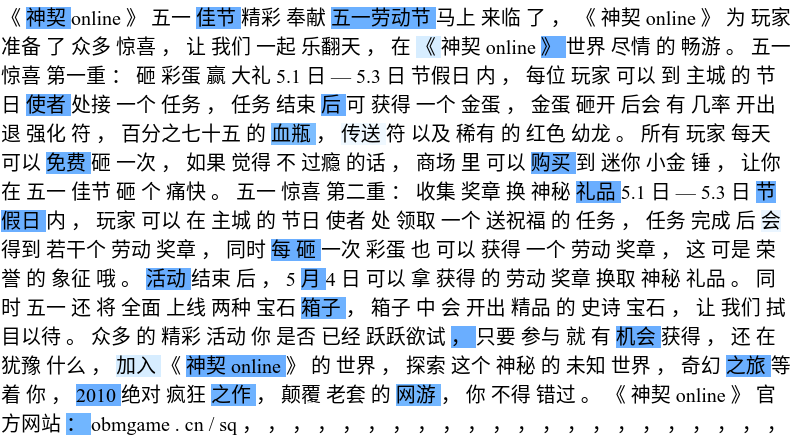
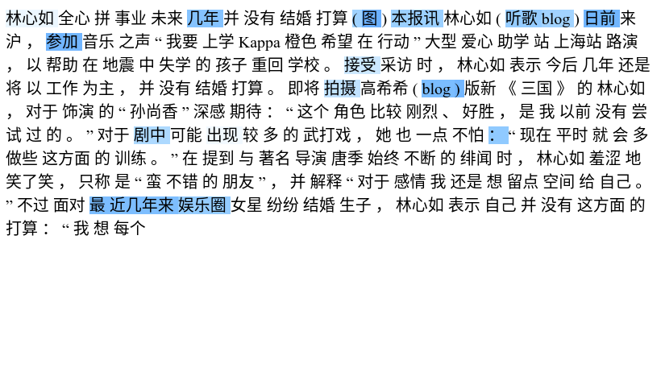
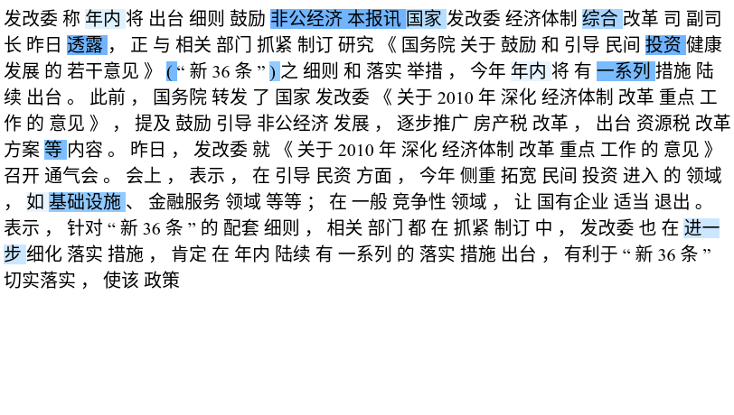

# SelfAttentiveSentenceEmbedding-TF

基于BiLSTM和Self-Attention的文本分类、表示学习网络

论文[《A Structured Self-attentive Sentence Embedding》](https://arxiv.org/abs/1703.03130)(ICLR 2017)
的模型实现

## 模型


本项目的实现与原文有一点小差异，本实现在最后获得句子的表示(图中M矩阵)后直接过`softmax`分类器了，而不是原文所说的两层`MLP`，这里主要是考虑到要削弱末级分类器的复杂度，强迫模型学习到更有效的表示(图中M矩阵)，这样有助于下游任务

## 使用
本项目主要提供一个`SentencePresentation`类，可以方便用户在各个场景下使用,仅需要几行代码即可训练模型：

```python
    network =SentencePresentation(wv, wv_dim=100, lstm_size=64, layers=1, dim_r=30, classes=4, dim_a=10, norm=0.5, lr=0.01)
    with tf.Session() as sess:
        network.fit(sess, './train_data.csv', epoch=2)
```

也可以通过`predict`方法快速得到`分类结果`, `attention`, 以及句子的`embedding`结果:
```python
    with tf.Session() as sess:
        dataset = Dataset(sess, './test_data.csv', 200, '\t', max_len=500, epoch=1)
        for c, ws, lens in dataset:
            labels, attentions, embedding = network.predict(sess, ws, lens)
```
完整示例见[main.py](./main.py)（*注：例子中train_data.csv文件由于体积太大无法传到github上，若有需要请联系我*）

## 模型输入
模型的训练需要输入:
- 训练样本
- word2vec词表

训练样本是`<label><\tab><word-id-1><\space>...<word-id-n>`的格式。这里给两个例子：
```
0	660 68441 11 2839 501 15241 893 1 85 17 311 18 17 77 18 18105 1 501 85 1004 161 19

1	2267 378 1322 10 917 1588 9 14859 6692 326 94534 2101 105 9019 4 341 541 28 0 341 
```
word2vec词表是一个从`<word-id>`到`<word vector>`的映射，实际上就是`word2vec`的输出。

**如果对于输入数据有任何疑问请联系我**

## 训练效果
游戏类文本的`attention`：



娱乐圈文本的`attention`:



政治类文本的`attention`:



## 关于数据源
数据来源于[THUCTC文本分类数据](http://thuctc.thunlp.org/message)，本项目用到了其中`政治`、`网络游戏`、`娱乐`三个类别的数据